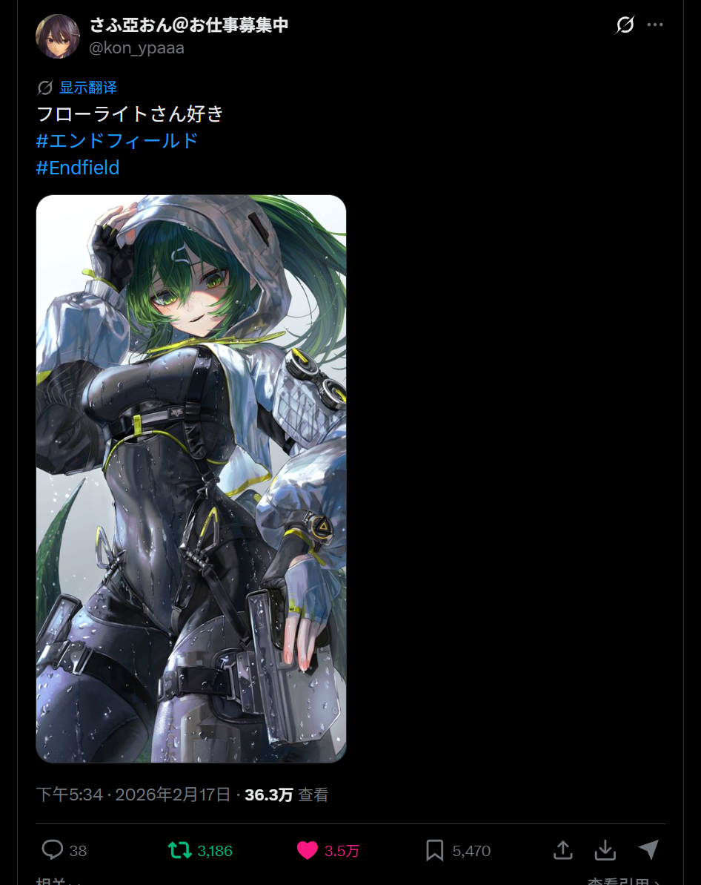
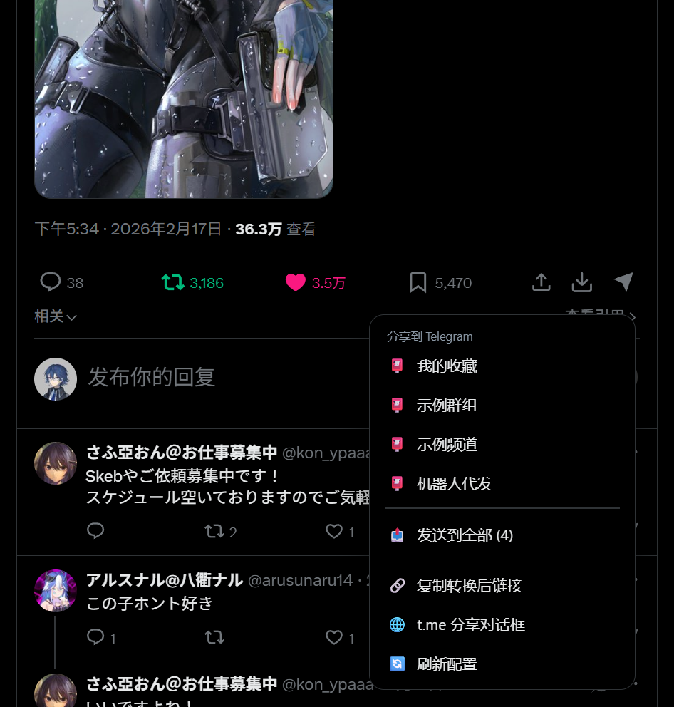

# TGShare ✈

> X/Twitter 一键分享到 Telegram —— 推文旁加分享按钮，一条链接直接发到指定频道/群组/机器人

[](LICENSE)
[](https://www.python.org/)
[](tgshare.user.js)
[](https://github.com/LenKiMo/tgshare)

在 X（原 Twitter）每条推文的操作栏注入一个纸飞机分享按钮（克隆原生按钮、样式零违和），点击后把推文发到你预设的频道、群组或机器人——**可以只发链接**（转成 Telegram 能抓预览的 fixupx / fixvx / fxtwitter / vxtwitter 域名），**也可以直接发图**：中继把推文图片下载后发成单图 / 原图相册 / 拼图，配文用**原版 x.com / twitter.com** 链接。

```
浏览器（Tampermonkey 油猴脚本）→ 本地中继(127.0.0.1:8787) → Telethon / Bot API → Telegram
        ↑ 媒体模式直接从 X 页面 DOM 取图（浏览器已登录 X，不依赖第三方接口）
```

## 🖼️ 效果预览

<p>
  
  
</p>

> 左：推文操作栏末端的 ✈ 按钮（克隆原生按钮，样式零违和）；右：点击后弹出的目标菜单。
> 截图为演示配置（虚构聊天目标），实际目标在 `config.json` 中随时可改。

## 📑 目录

- [🖼️ 效果预览](#️-效果预览)
- [✨ 功能特性](#-功能特性)
- [🧱 架构](#-架构)
- [🚀 快速开始](#-快速开始)
- [⚙️ 配置](#️-配置)
- [🎯 使用](#-使用)
- [🔒 安全设计](#-安全设计)
- [❓ 常见问题](#-常见问题)
- [📁 项目结构](#-项目结构)
- [🤖 AIGC 声明](#-aigc-声明)
- [📄 许可证](#-许可证)

## ✨ 功能特性

- **一键直达**：推文操作栏新增分享按钮（克隆原生按钮实现，尺寸/间距/悬停与 X 完全一致），点击弹出目标列表，再点即发送
- **分享形式可切换**（悬浮面板一键循环，写入 `config.json`，也能给单个目标单独指定）：
  - `link` **仅链接**：发送前自动转换 `x.com → fixupx.com`、`twitter.com → fxtwitter.com`（可切 fixvx / vxtwitter），Telegram 内显示完整媒体预览
  - `photo` / `album` / `mosaic` **图片 / 原图相册 / 多图拼图**：中继把推文图片下载后直接发出去（相册≤10 张原图），配文 = 推文正文 + **原版 x.com / twitter.com** 链接；正文超长、无图或下载失败时自动退回「仅链接」，绝不丢消息
  - 媒体来源优先 **X 页面 DOM**（浏览器已登录 X，图片 URL 就在眼前，不依赖第三方接口）；视频帖或 DOM 取不到时回退 `api.fxtwitter.com`
- **两种发送通道**：
  - `userbot`（默认）：Telethon 以自己的 Telegram 账号发送，消息与你手动发的一模一样，可发给**任何**聊天（含机器人）
  - `bot`：Bot API token，免登录，消息来自机器人
- **按目标选身份**：每个目标可单独指定发送者——有的目标用自己账号、有的用某个机器人；支持**多机器人注册表**（`bots`），互不干扰
- **目标随时改**：`config.json` 里维护按钮与目标聊天，浏览器端点「刷新配置」即时生效；也可用内置的 `/pick` 页面从聊天列表挑选
- **本地化域名面板**：悬浮面板内一键切换 fixupx/fixvx/fxtwitter/vxtwitter（持久化）
- **原生外观**：悬浮按钮实时克隆 X 原生按钮的绘制参数（背景/边框/尺寸/图标），带 2 秒自愈防漂移；大图/弹窗查看时自动隐藏
- **低干扰**：观察器仅在新增推文时扫描；请求经 `GM_xmlhttpRequest`（扩展上下文），绕开浏览器对页面访问本机服务的限制
- **安全默认**：仅监听 127.0.0.1、CORS 仅放行 x.com/twitter.com、`/send` 需令牌 + 目标白名单

## 🧱 架构

```
┌─────────────┐   GM_xmlhttpRequest    ┌──────────────────┐   MTProto / HTTP   ┌──────────┐
│  X / Twitter │ ────────────────────▶ │ 本地中继 server.py │ ─────────────────▶ │ Telegram │
│  (油猴脚本)  │    http://127.0.0.1   │  aiohttp+Telethon │                    │ (你的账号)│
└─────────────┘      :8787             └──────────────────┘                    └──────────┘
```

- **浏览器端**（`tgshare.user.js`）：注入推文按钮 + 悬浮面板；链接域名转换；配置拉取（`/config.js`）
- **中继**（`server.py`）：令牌鉴权、目标白名单、Telethon/Bot 发送、`/pick` 聊天选择器、安装页
- 中继不可达时自动降级：复制转换后链接 或 打开 t.me 分享对话框（可配置）

## 🚀 快速开始

### 0. 前置

- Python 3.11+（建议 [uv](https://github.com/astral-sh/uv) 管理虚拟环境）
- 装有 Tampermonkey（或 Violentmonkey）的 Chromium 系浏览器（Chrome / Edge / Brave）
- 一个 Telegram 账号（userbot 模式）或一个 Bot token（bot 模式）

### 1. 启动中继服务

```bash
git clone https://github.com/LenKiMo/tgshare.git
cd tgshare

# 依赖（uv 或 pip 均可）
uv venv .venv --python 3.11
uv pip install -p .venv/Scripts/python.exe -r requirements.txt
# 或：python -m venv .venv && .venv/Scripts/pip install -r requirements.txt

# 配置
cp config.example.json config.json   # Windows: copy config.example.json config.json
#   编辑 config.json：填入 api_id / api_hash（my.telegram.org 申请）与 targets
```

**userbot 模式需要登录一次**（交互式，验证码与两步验证密码在你自己的终端输入）：

```bash
.venv/Scripts/python.exe server.py --login
# 若未预填手机号：.venv/Scripts/python.exe login2.py <带国家码手机号>
```

启动服务：

```bash
.venv/Scripts/python.exe server.py
# 验证：curl http://127.0.0.1:8787/status  → {"ok":true,"mode":"userbot","authed":true,...}
```

### 2. 安装浏览器脚本

浏览器打开 `http://127.0.0.1:8787/`（安装页）→ 点击「安装用户脚本」→ Tampermonkey 确认。

刷新 X 页面即生效：每条推文操作栏末尾出现纸飞机按钮；右下角有悬浮面板。

## ⚙️ 配置

编辑 `config.json`（改完在 X 页面悬浮面板点「刷新配置」，或重载页面）：

```jsonc
{
  "mode": "userbot",            // 全局默认身份：userbot（自己账号）| bot（Bot API）
  "api_id": 12345678,           // my.telegram.org 申请
  "api_hash": "…",
  "bot_token": "",              // mode=bot（未指定别名时）使用的 token，@BotFather 创建
  "port": 8787,                 // 中继端口（浏览器脚本默认匹配，改后需同步改 tgshare.user.js 顶部 EMBED.relay）
  "service": "fixupx",          // 仅链接模式用的镜像域（面板可切换）：fixupx | fixvx | fxtwitter | vxtwitter
  "share_mode": "link",         // 分享形式（面板可切换）：link=只发链接 | photo=发首图 | album=发原图相册 | mosaic=多图拼一张
  "official_domain": "",        // 媒体模式的链接：留空=用页面上的原版链接；填 "x.com" 强制统一官方域
  "caption_template": "{text}\n\n{link}",   // 媒体模式配文：{text}=推文正文, {link}=原版链接（无正文时退回 text_template）
  "fallback": "copy",           // 中继不可达时：copy=复制链接 | share=打开 t.me 分享
  "text_template": "{link}",    // 仅链接模式的模板，可加前缀如 "📌 {link}"
  "bots": {                     // 多机器人注册表（token 只存本机，不下发浏览器）
    "botA": "123456:AA…",       //   别名 → token
    "botB": "654321:BB…"
  },
  "targets": [
    { "label": "我的收藏", "chat": "me" },                       // me = 我的收藏/保存的消息
    { "label": "自己的群", "chat": "@mygroup" },                 // 普通群组：userbot 或机器人成员均可发
    { "label": "个人频道", "chat": "@mychannel" },               // 默认身份（全局 mode）+ 全局分享形式
    { "label": "只发链接的频道", "chat": "@linksonly",            // 该目标强制只发链接（覆盖全局 share_mode）
      "share_mode": "link" },
    { "label": "机器人代发", "chat": -1001234567890,             // 数字 ID（群/频道为负数）
      "mode": "bot", "bot": "botA" }                             //   该目标用 botA 身份发送
  ]
}
```

**身份规则**：目标的 `mode` / `bot` 字段覆盖全局 `mode`（写了 `bot` 别名即隐含 bot 模式）；**分享形式规则**同理，目标的 `share_mode` 覆盖全局。发送权限提醒：**频道**里机器人必须是**管理员**才能发消息；**普通群组**机器人作为普通成员即可发言（除非群开启"仅管理员可发言"）；`chat: "me"` 需要你先给该机器人发一条消息（用于解析你的私聊 id）。

> 媒体模式发图时链接是**原版** `x.com` / `twitter.com`（不是镜像域）；如果图片发不出去（无图/正文超 1024 字/下载失败），会自动退回「仅链接」并把原因写进响应与日志。
> `auth_token` 留空会自动生成（浏览器脚本通过 `/config.js` 获取，用于 `/send` 鉴权）。
> userbot 模式下可用 `http://127.0.0.1:8787/pick` 可视化挑选目标聊天。
> **改完 config.json 不用重启**：中继检测到文件变动会自动热重载，浏览器面板点「刷新配置」即生效。

## 🎯 使用

| 动作 | 方式 |
|---|---|
| 分享当前推文到某个目标 | 点推文下方 ✈ → 选目标 |
| 分享视口中央的推文 | 点右下角悬浮 ✈ → 选目标（或「发送到全部」） |
| 切换分享形式 | 悬浮面板 →「分享形式：仅链接 / 图片 / 相册 / 拼图」循环切换（写入 config.json） |
| 切换链接域名 | 悬浮面板 →「链接域名：fixupx」循环切换（仅链接模式生效） |
| 复制分享链接 | 任一菜单的「复制分享链接」（媒体模式=原版链接） |
| 手动分享 | 菜单「t.me 分享对话框」 |

链接转换规则：`x.com → fixupx.com`（或 fixvx.com），`twitter.com → fxtwitter.com`（或 vxtwitter.com）——只在「仅链接」模式下生效；媒体模式的配文一律用页面上的**原版**链接（可用 `official_domain` 强制 `x.com`）。

**媒体模式怎么取图**：油猴脚本从推文 DOM 里按「媒体链接自带 `/status/<推文id>/photo/N`」定位图片（引用推文里的图 id 不同，天然被排除，不会被误发），拼图交给 `mosaic.fxtwitter.com`；中继把页面上的缩略图地址（`?format=webp&name=large`）重写成原图（`?format=jpg&name=orig`）下载后上传。视频帖取 `api.fxtwitter.com` 的 mp4（>45MB 则退回首帧封面）。发相册时 Telegram 只有第一条消息带配文，这是相册机制本身如此。

## 🔒 安全设计

- 中继只监听 `127.0.0.1`，不暴露到局域网/公网
- CORS 仅放行 `https://x.com` 与 `https://twitter.com`
- `/send` 与 `/dialogs` 需要 `X-Auth-Token` 头（令牌在 config.json，首次启动自动生成）
- `/send` 的目标必须是 `targets` 白名单内 —— 即使令牌泄露，也只能发到你自己的预设聊天
- 多机器人 token 只存在本机 `config.json` 的 `bots` 注册表，`/config.js` 不下发给浏览器（浏览器只拿到目标别名）
- `tgshare.session`（Telethon 会话）等于账号钥匙：勿提交、勿外传、勿放云盘
- 浏览器端必须用 `GM_xmlhttpRequest` 而非页面 `fetch`：新版 Chromium 的 Local Network Access 限制会拦截页面访问本机服务（详见 FAQ）

## ❓ 常见问题

**Q：面板显示「离线」？**
中继没起来：`curl http://127.0.0.1:8787/status`。若服务正常仍离线，检查 `config.json` 的 `port` 与脚本内 `EMBED.relay` 是否一致。

**Q：右下角悬浮按钮不见了 / 跑到页面中间了（错位）？**
按 `F12` 看控制台，脚本会打印诊断：
- `[TGShare] 未找到 X 原生悬浮按钮，按兜底位置显示悬浮按钮` → 页面上没有可对齐的原生悬浮按钮，已按右下角兜底位置显示（1.1.1 起不会再隐身）。
- `[TGShare] 对齐参照: <标签> {l,t,w,h}` → 悬浮按钮正贴在哪个原生悬浮按钮上方；若那个坐标不在右下角，就是认错了参照物。
- `[TGShare] 检测到弹窗/大图查看器，隐藏悬浮按钮` → 有大模态框打开；关掉即恢复（1.1.1 起只有铺满视口的大模态框才触发）。

1.1.2 → 1.2.0 修掉的错位来源（按发现顺序）：
1. **找不到锚点就 `visibility:hidden`** → 按钮彻底消失；现在找不到也按兜底位置显示。
2. **只判元素自身 `position:fixed`** → X 的悬浮按钮自身是 `static`（fixed 在外层容器上）→ 永远找不到锚点 → 退到兜底槽位、和 X 的悬浮行重叠。现改为「自身或任一祖先 `fixed/sticky`」。
3. **拿 X 的 DOM 标签+矩形猜锚点** → 选中了 `[data-testid="GrokDrawer"]`：一个 `400×55` 的**透明空壳**（DOM 在、视觉不在），于是按钮被放到看不见的容器上方，跟用户看得见的按钮隔了 79px，看起来「飘在半空」。**现在改用命中测试（`document.elementsFromPoint`）在右下角区块里扫描，只认「屏幕上真正存在的控件」**，透明空壳天然被排除；锚点取该列最靠上的可见控件，样式也只从可见控件克隆。
4. **写死采样位置** → X 的悬浮列在距右边约 35px 处，固定采 `innerWidth-20/-34` 会正好擦着它的右边缘过去，一个都采不到。现在是区块扫描 + 900ms 缓存（滚动时也不会拖慢页面）。
5. **居中/右边缘** → 参照物是宽容器时居中会把按钮推到屏幕中间；统一改为**右边缘对齐**（取同列所有可见控件的右边缘最大值），底边 = 参照顶边 − 12px。
6. **推文内按钮注入过宽** → 时间线里的「推荐关注」用户卡片也会被插一个裸飞机图标；现在必须先通过「真推文」校验（含状态永久链接+时间戳或推文正文，且操作栏里有 回复/转推/点赞/收藏 任一）。

**万一还是不合意**：悬浮按钮可以**直接拖动**，位置存 `localStorage`（之后不再自动对齐），面板里「🎯 重置悬浮按钮位置」可恢复自动对齐。控制台诊断日志：`[TGShare] 对齐参照(可见控件): …` / `[TGShare] 可见悬浮列 N 项 […]` / `[TGShare] 右下角没有可见悬浮控件…`，或在控制台执行 `document.documentElement.setAttribute('data-tgshare-dump','1')` 后点一下页面空白处打印完整转储。

**Q：为什么用 GM\_xmlhttpRequest？**
Chrome 142+ 启用了 Local Network Access（LNA）权限模型：https 页面直接 `fetch` 本机 `http://127.0.0.1` 会被以 `LocalNetworkAccessPermissionDenied` 拒绝，且**服务端响应头无法放行**。`GM_xmlhttpRequest` 由扩展上下文发起，天然豁免。

**Q：X 页面变卡？**
观察器只在新增推文时扫描，负载可忽略。若仍有大量 `ERR_BLOCKED_BY_CLIENT` 报错，通常是广告拦截器拦了 X 的 `viewer_context.json` 接口，与本项目无关。

**Q：userbot 模式需要 api_id/api_hash 吗？申请时一直报 ERROR？**
userbot 模式需要自己的 `api_id/api_hash`——用仓库内置的公共凭据（Telegram for Android 教学默认值）能跑通，但**极易触发风控**，强烈建议自备。申请入口与步骤：

1. 打开 https://my.telegram.org （入口：Telegram 官网 → 开发者 → API），用你的手机号登录（验证码发到 Telegram App）
2. 进入 **API development tools**，随意填写 *App title* / *Short name* → **Create application**
3. 拿到 `api_id`（数字）与 `api_hash`（字符串），填入 `config.json`（或 `config.example.json` 复制出的配置文件）

> ⚠️ **申请时机很关键**：在 my.telegram.org 填完表单点提交时，如果直接返回 `ERROR`（而不是进入下一步），几乎都是因为当前出口 IP 是**数据中心 / VPN / 代理 IP**——Telegram 会在 API 申请表单阶段拒绝这类网络环境。请换**家宽网络**重试：断开 VPN/代理，或直接用**手机流量开热点**给电脑。申请成功后日常登录与使用不受出口网络限制。

如果已有自己的凭据仍提示 `RECAPTCHA` 类风控/验证码，多为短时触发，等 1–3 分钟或换网络环境重试。

**Q：可以换端口吗？**
可以，改 `config.json` 的 `port`，同时把 `tgshare.user.js` 顶部 `EMBED.relay` 与安装页地址同步修改。

**Q：媒体模式发的图比 X 页面上看到的还清楚？**
正常。页面上的图是缩略图（`?format=webp&name=large`），中继会重写成原图（`?format=jpg&name=orig`）再上传；Telegram 侧会把图片压到最长边 2560、单张 ≤10MB。原图超过 9.5MB 时自动退到 2048px 版本；视频 >45MB 时只发首帧封面。

**Q：为什么媒体模式有时还是发了链接？**
三种情况会自动退回「仅链接」：推文没有图（纯文字/纯转推/已删除）、正文超过 1024 字（Telegram 图片配文上限）、图片下载或上传失败。响应里的 `media_error` 与 `tgshare.log` 都写了原因，消息本身不会丢。

**Q：媒体模式要不要额外的机器人/权限？**
不用。userbot 模式用自己的账号发，和手动转发没区别；bot 模式下发相册需要机器人在目标频道有**发布消息**权限（编辑/删除不用）。

## 📁 项目结构

```
tgshare/
├── server.py            # 本地中继：aiohttp + Telethon / Bot API，/send /config.js /pick 等（含媒体模式）
├── tgshare.user.js      # 油猴用户脚本（浏览器端全部逻辑：按钮、面板、DOM 取图）
├── login2.py            # 显式登录脚本（验证码 + 2FA 在本地终端输入）
├── _test_share_mode.py  # share_mode 纯函数自测（链接转换/媒体候选链/plan_media，不发消息）
├── config.example.json  # 配置模板（config.json 不入库）
├── requirements.txt
├── LICENSE
└── README.md
```

## 🤖 AIGC 声明

本仓库代码与文档由 AI 辅助生成（Hermes Agent，基于 DeepSeek 系列模型），并经过人工审查与实测验证。链接修复域名规则、X 页面 DOM 适配等技术细节会随平台变动更新。

## 📄 许可证

[MIT License](LICENSE)

---

**免责声明**：本项目仅供个人自动化与效率提升使用。请遵守 X / Twitter 与 Telegram 的平台条款，自行承担使用风险。本项目与 X（Twitter）及 Telegram 官方无任何关联。
